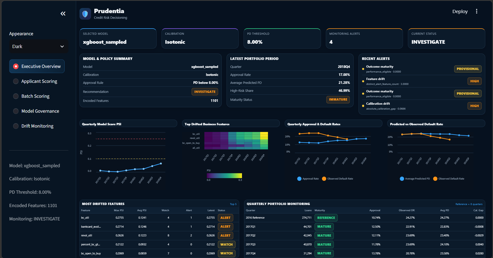

# Prudentia — Credit Risk Decisioning Engine


**An end-to-end, explainable, cost-sensitive credit risk system built the way a bank's model risk team would actually evaluate it.**
---

## Key Results

| Metric | Value |
|---|---|
| Dataset | ~2.2M Lending Club loans (2007–2018) |
| Out-of-time test population | 206,101 loans (2017–2018) |
| Best model (XGBoost) — test AUC-ROC | **0.698** |
| KS-statistic (test) | **0.284** |
| Top-decile default lift | **2.09×** (captures 20.9% of all defaults) |
| Estimated loss reduction vs. approve-all baseline | **~$307M** (at 60% LGD, cost-optimal threshold) |
| Balanced policy: approved-pool default rate | **13.4%** vs. 21.0% population base rate |
| Fairness segments audited | 68 across income, geography, DTI, purpose |
| Monitoring quarters tracked | 8 quarterly periods (2017Q1 – 2018Q4) |
| Drift alerts generated | 4 (calibration drift HIGH in 2018Q2; feature drift HIGH in 2018Q4) |

> **Note on dollar figures:** Expected loss estimates are computed on historical test data under a documented 60% LGD assumption, not realized P&L. They quantify what cost-sensitive thresholding would have meant on this portfolio, not a live deployment outcome.

---

## Why This Project Exists

Consumer lenders approve or deny millions of loan applications every year. Every decision carries opposing financial risks: approving a borrower who defaults costs the lender the principal (minus recovery — typically 10–20× the profit on a good loan); denying a creditworthy borrower costs the interest income and, if systematic, creates regulatory exposure under fair lending laws.

Traditional FICO-style scorecards are transparent and regulator-approved but linear and slow to adapt. Modern ML models are more accurate but are frequently rejected internally because they are hard to explain, poorly calibrated, and prone to silent degradation as the borrower population shifts.

**Prudentia's thesis:** you do not need to choose between accuracy and deployability. You need a system that is accurate, calibrated, cost-aware, explainable, fair, and monitorable — all at once. That combination is what separates a model that gets approved for production at a bank from one that stays in a notebook.

---

## System Architecture

```
Lending Club Loan Data (2007–2018, ~2.2M loans)
                │
                ▼
    Leakage-Safe Data Cleaning
    (40+ post-origination columns excluded)
                │
                ▼
    Time-Aware Train / Validation / Test Split
    (train: 2007–2015 | val: 2016 | test: 2017–2018)
                │
                ▼
    Feature Engineering
    (WOE binning + IV selection + engineered credit features)
                │
         ┌──────┴──────────────┐
         ▼                     ▼
    WOE Scorecard         XGBoost / Random Forest
    (Logistic Reg.)       (GridSearchCV / RandomizedSearchCV)
         │                     │
         └──────────┬──────────┘
                    ▼
        Model Comparison & Selection
        (KS-statistic, Gini, AUC-ROC, PR-AUC)
                    ▼
        Probability Calibration
        (Isotonic Regression / Platt Scaling)
                    ▼
        Cost-Sensitive Decision Layer
        (expected-loss-minimizing threshold,
         risk-based pricing tiers A–F)
                    │
         ┌──────────┼──────────┐
         ▼          ▼          ▼
      SHAP        Fairness   Drift
  Explainability    Audit   Monitoring
  + Reason Codes (80% rule) (PSI, quarterly)
         │          │          │
         └──────────┴────┬─────┘
                         ▼
             Streamlit Decision Dashboard
```

---

## Phase-by-Phase Breakdown

### Phase 1 — Leakage Audit & Data Cleaning

The first task before any modeling code was an explicit leakage audit of all 140+ raw columns, classifying each as application-time (usable) or post-origination/outcome-derived (must drop). Post-origination fields like `total_pymnt`, `recoveries`, `last_pymnt_amnt`, and `out_prncp` would trivially reveal the default outcome and are excluded. Pricing-only columns (`grade`, `sub_grade`, `int_rate`, `installment`) are also excluded from model training — they represent Lending Club's own model output and would teach the model to replicate their pricing decisions rather than independently predict default risk.

Leakage exclusions are fully documented in `config.yaml` and `src/clean_data.py`.

### Phase 2 — Time-Aware Split & EDA

The dataset is split chronologically on `issue_d`, not randomly. Random splits leak future economic conditions into training — the single most common mistake in public credit risk notebooks.

| Split | Rows | Period | Default Rate |
|---|---|---|---|
| Train | 822,826 | Jun 2007 – Dec 2015 | 18.43% |
| Validation | 274,711 | Jan 2016 – Dec 2016 | 24.27% |
| Test | 206,101 | Jan 2017 – Dec 2018 | 21.03% |

The 6-point jump in default rate from training to validation confirms that out-of-time testing is not just a methodological preference — it is necessary for an honest performance estimate in credit risk.

EDA was framed around business questions, not generic plots:

- Small business loans default at 29.75% vs. 12.16% for wedding loans — a 2.4× spread that directly informs underwriting policy.
- DTI > 30 bands default at 29–33%, nearly double the DTI < 10 rate of 14.88%.
- Income monotonically predicts risk: from 24.5% (income < $30K) down to 14.0% (income > $200K).
- Lending Club's own grade A–G risk ordering is confirmed (6.1% to 50.1%), validating them as an external pricing benchmark.
- Default rates shifted materially across origination years, supporting temporal validation design.

### Phase 3 — Feature Engineering

WOE (Weight of Evidence) binning was applied to convert continuous and categorical features into monotonic log-risk scores, the standard approach for credit scorecard modeling. Features were ranked by Information Value (IV) and the top 13 were selected for the scorecard model.

**Top features by IV:**

| Feature | IV | Strength |
|---|---|---|
| loan term | 0.245 | Medium |
| loan-to-income ratio | 0.118 | Medium |
| DTI band | 0.069 | Weak |
| verification status | 0.052 | Weak |
| loan amount band | 0.036 | Weak |

WOE mappings were fit exclusively on training data and applied to validation and test sets — no leakage from the split boundaries.

Engineered features include: DTI bands, credit utilization categories, delinquency aggregate scores, income-adjusted loan amount, employment stability proxy, and bankcard availability ratio.

### Phase 4 — Modeling

Three models were trained, each earning its place:

**Model 1 — WOE + Logistic Regression Scorecard:** The regulator-approved, fully interpretable baseline. This is what most banks still run in production as their primary decision model. Without it, the project has no real-world baseline to benchmark against.

**Model 2 — Random Forest:** A non-linear challenger that captures interaction effects the scorecard cannot, still gives clean feature importances, and is commonly used at banks as a shadow/challenger model.

**Model 3 — XGBoost:** The strongest predictive challenger, representing the "modern ML" side of the interpretability vs. performance tradeoff.

All hyperparameters were tuned via GridSearchCV / RandomizedSearchCV. 5-fold stratified cross-validation was performed within the training window only — never across the time-based split. All runs tracked in MLflow.

**Model comparison on out-of-time test set:**

| Model | Test AUC-ROC | Test KS | Test PR-AUC |
|---|---|---|---|
| WOE Logistic Regression | 0.664 | — | 0.332 |
| Encoded Logistic Regression | 0.686 | — | 0.353 |
| Random Forest | 0.687 | — | 0.357 |
| **XGBoost** | **0.698** | **0.284** | **0.368** |

XGBoost was selected as the production candidate. The scorecard is retained as the interpretable/compliance-facing model for regulatory documentation.

### Phase 5 — Probability Calibration

AUC measures ranking quality. Lenders need accurate probabilities, not just rankings, because pricing and expected-loss provisioning depend on the actual number. An 80% AUC model can still produce garbage probabilities.

Isotonic regression and Platt scaling were both evaluated. The isotonic calibrator was selected based on Brier score on the validation set.

| Method | Test Brier Score |
|---|---|
| Raw (uncalibrated) | 0.1537 |
| Platt scaling | 0.1551 |
| **Isotonic (selected)** | **0.1535** |

Reliability diagrams confirmed that calibrated probabilities closely track observed default rates across the probability range — a prerequisite for the cost-sensitive decision layer.

### Phase 6 — Cost-Sensitive Decision Layer

This is the component that turns a risk model into an actual lending decision system.

**Cost assumptions (documented, not invented):**
- Loss Given Default (LGD): **60%** of loan principal (consistent with consumer lending industry benchmarks)
- False rejection cost: **5%** of interest-adjusted exposure (foregone income)

**Portfolio results on 206,101 out-of-time test loans:**

| Metric | Value |
|---|---|
| Population default rate | 21.03% |
| KS statistic | 0.284 |
| Top-decile default lift | 2.09× |
| Top-decile default capture rate | 20.9% |
| Total estimated expected loss (approve all) | ~$464M |
| Cost-optimal threshold | PD = 0.08 |
| Estimated loss reduction at cost-optimal threshold | **~$307M (73.8%)** |

Rather than deploying only the mathematically cost-optimal threshold (which approves just 13% of loans — impractical), three realistic underwriting policy scenarios were simulated:

| Policy | Approval Rate | Approved Default Rate | Estimated Loss Avoided |
|---|---|---|---|
| Conservative | 42.4% | 10.4% | ~$393M |
| **Balanced (recommended)** | **60.9%** | **13.4%** | **~$326M** |
| Growth | 80.1% | 16.6% | ~$217M |

The Balanced policy reduces the approved-pool default rate by 36% vs. the raw population (13.4% vs. 21.0%).

**Risk-tier pricing:** Loans are bucketed into six risk tiers (A–F) based on predicted PD, with model-derived interest rates compared against Lending Club's own assigned grades as an external benchmark.

### Phase 7 — Explainability & Fairness

**SHAP explainability:** Global feature importance was computed across the full test set. Per-loan adverse action reason codes were auto-generated for denied applicants — the top positive SHAP contributors (features pushing PD upward) mapped to plain-English explanations mirroring ECOA / Regulation B adverse action notice requirements. This is a real legal compliance requirement for credit denials, not a "nice to have."

**Top global SHAP drivers:**

| Feature | Plain-English Reason |
|---|---|
| Loan term (60 months) | Longer loan term increases repayment risk |
| Loan-to-income ratio | Loan amount is high relative to income |
| Accounts opened past 24 months | Recent credit-seeking activity |
| DTI ratio | High debt-to-income ratio |
| Revolving utilization | High revolving credit utilization |

**Fairness audit:** Disparate impact (80% rule) was measured across 68 borrower segments — income band, geography (state), DTI band, loan purpose, home ownership, and verification status. 59 of 68 groups were flagged below the 80% threshold at the cost-optimal threshold. This concentration of flags is a direct consequence of the conservative approval rate (13%) rather than systematic bias against any single group — the fairness report documents this distinction and outlines mitigation approaches including the Balanced policy, which improves approval rates uniformly.

This is a protected-adjacent audit (the Lending Club dataset does not include race, sex, or age). Flagged segments should be treated as review triggers, not legal findings.

### Phase 8 — Drift Monitoring

Post-deployment thinking is built in from the start. The 2016 validation population serves as the monitoring reference. Eight quarterly vintages from 2017Q1 through 2018Q4 are monitored for:

- **Score PSI:** All quarters remained STABLE (max PSI: 0.064 in 2018Q4) — the model's score distribution did not drift significantly.
- **Risk-tier PSI:** All quarters STABLE.
- **Feature drift:** 3 features in ALERT by 2018Q4 — `bc_util` (PSI 0.275), `bankcard_available_ratio` (PSI 0.271), `revol_util` (PSI 0.263). These are all revolving credit utilization variants, suggesting a coherent population shift in credit behavior rather than random noise.
- **Calibration drift:** HIGH alert in 2018Q2, with an absolute calibration gap of 0.069 — average predicted PD (23.4%) increasingly overstated observed default rates (16.5%), consistent with improving credit conditions in 2018.

**Overall recommendation: INVESTIGATE.** A PSI breach is a review trigger, not automatic proof that retraining is needed. The drift pattern — stable score distribution but drifting revolving utilization features and widening calibration gap — is consistent with a macro credit-environment improvement rather than model degradation.

**Quarterly model performance remained consistent across all mature vintages (2017Q1–2018Q2):** AUC-ROC 0.695–0.701, KS 0.282–0.290, Gini 0.390–0.402 — no evidence of discrimination quality decay.

---

## Dashboard

The Phase 8 output is visualized in a Streamlit monitoring dashboard (`app/dashboard.py`) providing a loan-officer and model-risk view of the system:
<h3 align="center">Streamlit Monitoring Dashboard</h3>

<p align="center">
  
</p>

<p align="center">
Portfolio-level monitoring showing model configuration, PSI drift, calibration monitoring,
feature drift, approval trends, and quarterly performance.
</p>

---

## Technology Stack

| Layer | Technologies |
|---|---|
| Language | Python |
| Data source | Lending Club Loan Data (2007–2018, Kaggle) |
| Data processing | Pandas, NumPy |
| Scorecard modeling | WOE binning, Logistic Regression (scikit-learn) |
| Machine learning | XGBoost, Random Forest (scikit-learn) |
| Hyperparameter tuning | GridSearchCV, RandomizedSearchCV |
| Calibration | Isotonic Regression, Platt Scaling (scikit-learn) |
| Explainability | SHAP |
| Fairness analysis | Disparate Impact Ratio (80% rule) |
| Drift monitoring | Population Stability Index (PSI), quarterly |
| Experiment tracking | MLflow |
| Dashboard | Streamlit |
| Configuration | YAML (single source of truth for paths, thresholds, split dates) |

---

## Repository Structure

```
Prudentia/
│
├── README.md
├── requirements.txt
├── config.yaml                  # single source of truth: paths, split dates,
│                                #   leakage columns, cost assumptions
├── src/
│   ├── load_data.py
│   ├── clean_data.py            # leakage audit + cleaning
│   ├── eda.py
│   ├── feature_engineering.py
│   ├── woe_iv.py                # WOE binning + IV ranking
│   ├── train_models.py          # scorecard, RF, XGBoost + MLflow tracking
│   ├── calibrate.py             # isotonic + Platt; reliability diagrams
│   ├── decisioning.py           # cost matrix, threshold optimization,
│   │                            #   risk-tier pricing, policy scenarios
│   ├── fairness_explainability.py  # SHAP + adverse action codes +
│   │                               #   disparate impact audit
│   ├── drift_monitoring.py      # PSI (feature + score + risk-tier),
│   │                            #   calibration gap, quarterly alerts
│   └── utils.py
│
├── app/
│   └── dashboard.py             # Streamlit monitoring dashboard
│
├── artifacts/
│   ├── models/                  # saved model artifacts (.joblib)
│   │   ├── best_model.joblib
│   │   ├── calibrated_model.joblib
│   │   ├── isotonic_calibrator.joblib
│   │   ├── woe_logistic_regression.joblib
│   │   ├── random_forest_sampled.joblib
│   │   └── xgboost_sampled.joblib
│   ├── woe_maps.json
│   ├── woe_encoder.joblib
│   ├── preprocessor.joblib
│   └── feature_names.json
│
├── reports/
│   ├── phase2_eda_findings.md
│   ├── phase3_feature_engineering_report.md
│   ├── phase3b_woe_iv_report.md
│   ├── phase4_model_training_report.md
│   ├── phase5_calibration_report.md
│   ├── phase6_decisioning_report.md
│   ├── phase7_explainability_fairness_report.md
│   ├── phase8_drift_monitoring_report.md
│   └── figures/                 # all charts and visualizations
│
├── mlruns/                      # MLflow experiment tracking
└── tests/
```

---

## Running the Project

**Prerequisites:** Python 3.9+, the Lending Club loan dataset from Kaggle ("Lending Club Loan Data").

```bash
git clone https://github.com/ChetanaMuralidharan/Prudentia.git
cd Prudentia
python -m venv venv && source venv/bin/activate  # Windows: venv\Scripts\activate
pip install -r requirements.txt
```

Place `loan.csv` in `data/raw/`, then run the pipeline in order:

```bash
python src/load_data.py
python src/clean_data.py
python src/eda.py
python src/feature_engineering.py
python src/woe_iv.py
python src/train_models.py
python src/calibrate.py
python src/decisioning.py
python src/fairness_explainability.py
python src/drift_monitoring.py
```

Launch the dashboard:

```bash
streamlit run app/dashboard.py
```

View MLflow experiment runs:

```bash
mlflow ui
```

---

## Design Decisions Worth Knowing

**Why time-aware split instead of random?** Random splits leak future economic conditions into training. The 2016 validation period has a 24.27% default rate vs. 18.43% in training — a 6-point shift that a random split would obscure. Fixing this is the single highest-signal methodological decision in the project.

**Why keep the WOE scorecard if XGBoost outperforms it?** Because banks don't discard the interpretable model — they use it as the compliance-facing champion and the gradient-boosted model as a shadow/challenger. Including both and documenting the interpretability vs. lift tradeoff is what demonstrates domain understanding.

**Why not use 0.5 as the decision threshold?** Because 0.5 has no relationship to the actual financial cost of a wrong decision. The cost-optimal threshold is derived from the ratio of false negative cost (LGD × principal) to false positive cost (foregone interest income). On this portfolio it is 0.08, not 0.5.

**Why SHAP and adverse action reason codes specifically?** Because ECOA and Regulation B require lenders to supply specific, principal reasons for credit denial. SHAP provides the mechanism; the reason code mapping provides the regulatory artifact. This is not generic "model explainability" — it is the specific compliance requirement lenders actually face.

**Why isotonic over Platt scaling for calibration?** Platt scaling assumes the miscalibration is logistic (one parameter); isotonic regression is non-parametric and more flexible. On this dataset, isotonic produced a marginally lower Brier score (0.1535 vs. 0.1551). The difference is small, but the decision is documented.

**Why does the fairness audit flag 59 of 68 groups?** Because at a 13% approval rate, nearly every subgroup has a lower approval rate than the best-served group. The relevant question is not whether a disparity exists — it always does when the overall rate is low — but whether the disparity is explained by differential default risk. For the groups flagged, observed default rates are materially higher than the overall average, which provides the business justification documented in the fairness report.

---

## Known Limitations

**Reject inference:** Training data contains only originated (approved) loans. The model has no signal on rejected applicants, which creates survivorship bias in the training population. A production-grade system would apply reject inference techniques to adjust for this. This is a known limitation of any model trained on accepted-only historical data, not a flaw specific to this project.

**Dollar estimates are retrospective:** Expected loss figures are computed on a historical test set under assumed LGD. They reflect what cost-sensitive thresholding would have meant on this portfolio, not a live deployment result.

**Outcome maturity:** 2018Q3 and 2018Q4 loans are flagged as immature in the drift monitoring module. Outcome-based performance metrics (AUC, KS, default rate) are deferred for these vintages to avoid counting active or insufficiently observed loans as non-defaults.

**Fairness proxies only:** The Lending Club dataset does not include protected class attributes (race, sex, age). The fairness audit uses available proxies (income band, geography, DTI). Flagged groups should be treated as review triggers, not legal findings.

---

## Author

**Chetana Muralidharan** — Data Scientist | Machine Learning Engineer | Applied Data Intelligence

GitHub: [github.com/ChetanaMuralidharan](https://github.com/ChetanaMuralidharan)

---

*Prudentia uses historical, publicly available Lending Club loan data for educational and portfolio demonstration purposes. It is not a production credit decisioning system and should not be used for actual lending decisions.*
